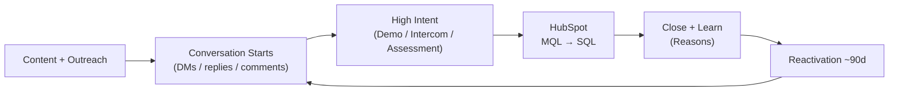
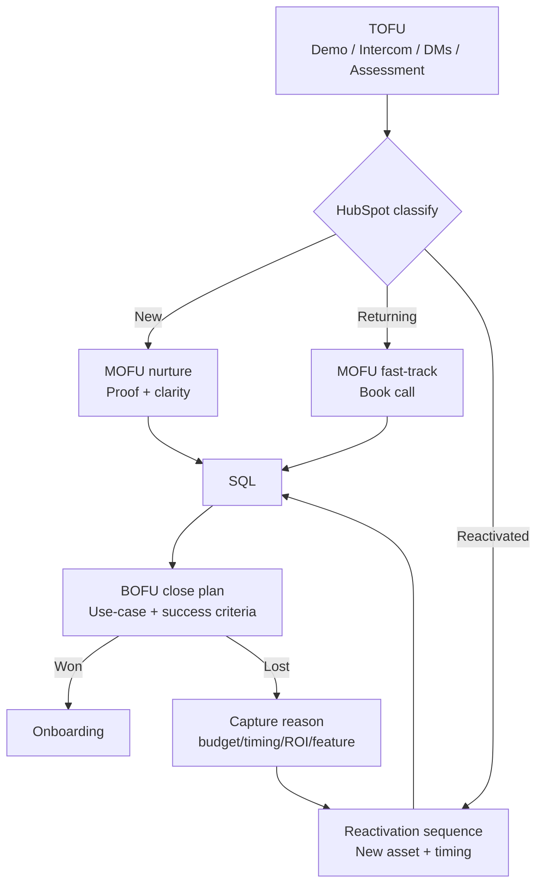
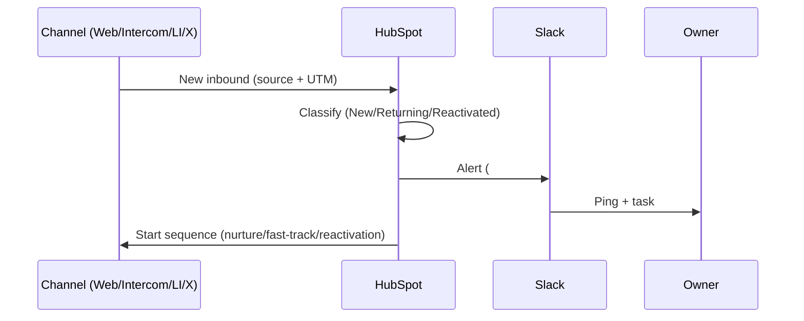

### Dragonfly 2026 GTM Strategy
##### Research → Channels → Funnel → Execution (Feb 2026 launch)

    <svg role="img" viewBox="0 0 24 24" xmlns="http://www.w3.org/2000/svg" style="height: 60px; margin: 0; fill: white;"><title>LinkedIn</title><path d="M20.447 20.452h-3.554v-5.569c0-1.328-.027-3.037-1.852-3.037-1.853 0-2.136 1.445-2.136 2.939v5.667H9.351V9h3.414v1.561h.046c.477-.9 1.637-1.85 3.37-1.85 3.601 0 4.267 2.37 4.267 5.455v6.286zM5.337 7.433c-1.144 0-2.063-.926-2.063-2.065 0-1.138.92-2.063 2.063-2.063 1.14 0 2.064.925 2.064 2.063 0 1.139-.925 2.065-2.064 2.065zm1.782 13.019H3.555V9h3.564v11.452zM22.225 0H1.771C.792 0 0 .774 0 1.729v20.542C0 23.227.792 24 1.771 24h20.451C23.2 24 24 23.227 24 22.271V1.729C24 .774 23.2 0 22.222 0h.003z"/></svg>
    
    
    
    
    
    

| Constraint | What it means for GTM |
| --- | --- |
| **Launch** | Feb 2026 (mid Q1) |
| **ICP** | Founders/CEOs + Dept/Product/Technical leads at tech-first scale-ups |
| **Pricing** | £100–£200/month/business at launch (upsell later) |
| **Target** | £500k ARR by end of 2026 |
| **Budget** | Organic/unpaid first 6 months until repeatable cycle |

====

#### North Star (first 6 months)
##### Build a repeatable acquisition loop **before** paid spend

| Loop stage | We measure | We improve |
| --- | --- | --- |
| **Distribution** | Post reach + saves + profile visits | Topic + hook + format |
| **Conversation starts** | DMs + replies + inbound questions | CTA + targeting + follow-ups |
| **High intent** | Demo form + Intercom + assessment completions | Offer clarity + friction removal |
| **Pipeline** | MQL → SQL → Close + cycle time | Qualification + sequences |
| **Learn & iterate** | Reasons won/lost | Messaging + product packaging |
| **Reactivation** | Reopened conversations | Timing + triggers + new assets |

====

#### The “engine” diagram (simple)

----

### 1) Assumptions
##### Making explicit so we can validate fast

| Assumption | Why it matters | How we validate in 2 weeks |
| --- | --- | --- |
| Buyers live where they learn: **LinkedIn + X** (+ selective communities) | Fastest signal + decision-maker density | Track replies/DMs per persona + per topic |
| Win by **practical outcomes**, not AI hype | Product is “readiness + roadmap” | Test offer: score + 30-day roadmap + policy kit |
| Early growth is **high-trust distribution** | Borrowed trust beats spend | Podcasts + operator communities + founder content |
| Hold paid until repeatable conversion path | Prevents wasted CAC | Only spend after channel+message reliably produces SQL |

====

#### What “repeatable” means (definition)
| Signal | Threshold (directional) | Decision |
| --- | --- | --- |
| Same message repeatedly creates conversations | Replies/DMs rising week-on-week | Scale content + outreach volume |
| High-intent actions follow | Demo/assessment starts tracked by source | Double down on top offers |
| SQL conversion stabilises | MQL→SQL consistent by channel | Introduce small paid tests |
| Cycle time shrinks | Faster time-to-SQL / time-to-close | Lean into winner channel |

----

### 2) Research approach
##### Validate channels + messaging quickly (then scale what works)

| Workstream | Data sources | Output (what we build) |
| --- | --- | --- |
| Voice of customer (VOC) | 15–25 interviews (Founder/CEO, CTO, Head Product, Ops/RevOps) | Persona message maps + trigger moments + objections |
| Social listening | LinkedIn + X keywords, comment threads, operator posts | Topic backlog + “language bank” (exact phrasing) |
| Competitive/adjacent scan | Consultancies, maturity assessments, playbooks, tooling | Positioning gap: “stuck between experimentation & adoption” |
| Instrumentation | UTMs → HubSpot lifecycle → attribution | Source→conversion→cycle time + lead type split |

====

#### A) VOC sprint (2 weeks)
##### Fast, structured, directly usable for GTM

1. **Recruit** 15–25 ICP calls (use network + SalesNav + communities).
2. **Ask for reality**:
   - “What triggered this conversation internally?”
   - “What failed with AI adoption so far?”
   - “Who owns budget + who blocks?”
3. **Extract**:
   - Top 3 trigger moments
   - Top objections (timing, budget, ROI, security, change mgmt)
   - Words they use verbatim
4. **Turn into assets** (immediately):
   - “AI Readiness Score + 3 actions”
   - “30-day adoption roadmap (template)”
   - “AI policy starter kit”

====

#### B) Message map (per persona)
| Persona | Pain (what they feel) | Promise (outcome) | Proof (asset) | CTA |
| --- | --- | --- | --- | --- |
| Founder/CEO | “Tools everywhere, no plan” | Clear roadmap + accountability | Score + 30-day plan | “Get your score” |
| CTO | “Security/governance risk” | Guardrails + rollout plan | Policy kit + checklist | “Review templates” |
| Head of Product | “Inconsistent productivity” | Practical workflow adoption | Use-case roadmap | “See example roadmap” |
| Ops/RevOps | “Tool sprawl + chaos” | Standardised rollout process | Playbook + KPI dashboard | “Get the playbook” |

====

#### D) What we instrument from day 1 (HubSpot)
| Metric layer | What we track | Why it matters |
| --- | --- | --- |
| Leading indicators | Impressions, saves, profile visits, replies/DMs | Early signal before pipeline |
| High-intent actions | Demo form, Intercom chats, assessment completions | Closest proxy to buying intent |
| Funnel | MQL→SQL→Close + cycle time | Tells us what to scale |
| Lead type split | **New / Returning / Reactivated (closed-lost/churn)** | Controls routing + sequences |
| Attribution | Source + campaign (UTM discipline) | Prevent “we don’t know what worked” |

----

### 3) Channel strategy (organic-first)
##### Prioritise where decision makers already are, then compound trust

| Channel | Why it’s priority | First actions (weeks 1–6) | “Working” signal |
| --- | --- | --- | --- |
| **LinkedIn** | Highest founder/operator density | SalesNav list + weekly teardown + targeted DM tests | Replies + demo requests |
| **X** | Fast feedback + founder discourse | Ship POV threads + reply-led distribution | Conversation starts |
| **Selective communities** | Peer validation | Answer implementation threads + drop usable assets | Warm inbound |
| **Events (selective)** | Trust compression | 1–2 events; harvest use-cases; turn into content | Qualified leads + insights |
| **Podcasts** | Borrowed trust at scale | ETN / The Venture Show style appearances + asset launch | Warm inbound spikes |
| **Paid (later)** | Only after repeatability | Retargeting + ICP-dense sponsorship | Predictable CAC direction |

====

#### Priority 1: LinkedIn + X (how we execute)
##### “Practical operator content” + precision targeting

| Play | What it looks like | Why it works |
| --- | --- | --- |
| AI Readiness teardown (weekly) | 5 bullets: what’s broken → fix → 30-day plan → CTA | Clarity + authority |
| Operator snippet (video) | 60–90s: one problem → one framework → CTA | Trust faster than text |
| SalesNav targeting | Titles + geo + stage; test messaging | Tight ICP, fewer wasted touches |
| Comment-led distribution | Thoughtful replies on ICP posts | Earn attention without paid |

Links (optional): [LinkedIn Sales Navigator](https://www.linkedin.com/sales/), [LinkedIn](https://www.linkedin.com/), [X](https://x.com/)

====

#### Priority 2–4: Communities, Events, Podcasts (trust accelerators)
| Channel | What we do | Example from experience |
| --- | --- | --- |
| Communities | Show up where operators ask “how do I actually ship this?” | High-signal threads outperform generic “AI news” |
| Events | Go where buyers concentrate (even if unsexy) | Briefcase-style: accountant conferences as a wedge |
| Hackathons (edge case) | Attend selectively for high-intent builders | Often produces unexpectedly productive conversations |
| Podcasts | Launch assets on-air (not just product talk) | One appearance → many warm conversations |

----

### 4) GTM plan & funnel design (HubSpot-led)
##### Simple funnel, clean classification, clear sequences

| Stage | Entry points | Goal | Owner/tooling |
| --- | --- | --- | --- |
| **TOFU** | Website demo form, Intercom, LinkedIn/X DMs, assessment | Create conversations + capture intent | Web/Intercom + social |
| **MOFU** | HubSpot ingestion + classification | Qualify + educate + move to SQL | HubSpot |
| **BOFU** | Close plan + success criteria | Close or learn why not | Sales motion + notes |
| **Reactivation (~90d)** | Closed-lost/churned sequence | Re-enter before budget reset | HubSpot sequences |

====

#### Funnel diagram (technical but readable)

====

#### Lead classification (entity resolution)
##### Make HubSpot routing deterministic (no guesswork)

| Lead type | Definition | Routing | Sequence |
| --- | --- | --- | --- |
| **New** | Contact/company not in CRM | Standard qualification | 7–10 day proof + clarity |
| **Returning** | Known, not previously closed-lost/churn | Fast-track if high intent | Short “book call” sequence |
| **Reactivated** | Previously closed-lost/churn | Senior review + targeted follow-up | Reactivation (~90d) with new asset |

====

#### Sequences (what runs automatically)
| Sequence | Trigger | Content | Outcome |
| --- | --- | --- | --- |
| Proof + clarity | New MQL | Before/after, pitfalls, roadmap sample | Book SQL call |
| Persona follow-up | CTO/Product/Founder intent | Tailored proof + asset | Reduce objections |
| Reactivation (~90d) | Closed-lost/churned | “What changed” + benchmark + new feature | Restart conversation |

----

### 5) Execution system (coordination across workstreams)
##### HubSpot as source of truth, Slack as execution, Apps Script for lean automation

| Tool | What it does | Why now (cost + speed) |
| --- | --- | --- |
| **HubSpot** | Pipeline, lifecycle, sequences, attribution | Central operating system |
| **Slack** | Alerts + handoffs (“hot lead” pings) | Speed to response |
| **Google Apps Script** | Lightweight automation + hygiene | Avoid early n8n/Zapier overhead |

====

#### Slack alerting (what happens when an inbound lands)

====

#### Weekly cadence (consistent loop)
| Meeting/output | Questions we answer | Decision |
| --- | --- | --- |
| Weekly GTM review | What produced qualified inbound? What message got replies? What moved fastest to SQL+close? | Kill low-signal. Double down on winners. |
| Content planning | What did we learn from VOC + objections? | Ship next assets. |
| Pipeline hygiene | Are sources + lead types correct? | Fix attribution + routing. |

----

### 6) Budget allocation
##### “Think bootstrapped, then scale like venture-backed.”

| Budget principle | What we do first | When we spend |
| --- | --- | --- |
| Treat **time** as budget | Content + community + outreach + podcasts | Only behind proven conversion |
| Spend behind traction | Double down where inbound → SQL is repeatable | Retargeting / ICP sponsorship |
| Keep tooling lean | HubSpot + Slack + Apps Script | Add more tools only if needed |

====

#### Paid spend gating (clear rule)
| Gate | Evidence required | First paid tests |
| --- | --- | --- |
| Channel repeatability | Same channel drives consistent high-intent | **Retargeting site visitors** (Plug the leaky bucket) |
| Message repeatability | Same offer converts to SQL | **Boost best organic posts** (Scale what works) |
| CAC/LTV direction | Directionally predictable | **High-intent Search Ads** (Capture demand) |

----

### 7) Metrics & success measurement
##### Measure what matters: attributable pipeline + revenue (not vanity)

| Layer | KPI | Why it’s essential |
| --- | --- | --- |
| Leading | Saves, comments, DM/reply rate | Predicts pipeline early |
| High intent | Demo requests, Intercom chats, assessments completed | Strong purchase intent proxy |
| Funnel | MQL→SQL, SQL→Close, time-to-close | Repeatability + efficiency |
| Attribution | Pipeline + revenue by source | “What worked?” becomes objective |
| Quality | Reasons won/lost, activation signals | Improves close + retention |

====

#### “Definitive metric” (what we report to founders)
| Report | Contains | Used for |
| --- | --- | --- |
| Weekly scoreboard | Inbound by source, high-intent, SQL, close rate, cycle time | Decide what to scale |
| Monthly insights | Best topics/offers, objection trends, channel ROI direction | Plan next month |
| Win/loss notes | Top reasons + exact language | Fix positioning + product |

----

### 8) Creative ways to stand out (low cost, high talkability)
| Play | What it is | Why it gets shared |
| --- | --- | --- |
| **AI Readiness Index (quarterly)** | Anonymous benchmark from assessments | “Where do we stand?” curiosity |
| Teardown series | Why rollouts fail + 30-day fix | Practical + provocative |
| Operator-first assets | Policy templates, roadmaps, KPI dashboards | Immediately usable |
| Build-in-public (light) | Product lessons + culture | Trust compounds (Cursor/Ryo effect) |

====

### Newsletter loop (compounding distribution)
##### Proven “low-cost, long-term” acquisition

| Motion | Platform example | Outcome |
| --- | --- | --- |
| Publish every week | Ghost newsletter + blog | GEO + SEO + recurring attention |
| Repurpose | Turn blog into LinkedIn + X posts | More reach per hour |
| Convert | Link to assessment/demo | Measurable pipeline |

Links (optional): [Ghost](https://ghost.org/)

----

### 9) Why I’m confident I can execute this
| Proof point | What I’ve done before | How it applies here |
| --- | --- | --- |
| Inbound engine | Newsletter scaled to ~18,000 subscribers; repurposed across channels | Same compounding loop for Dragonfly |
| ICP targeting | SalesNav filtering + list building | Faster learning on messaging |
| Distribution mechanics | Landscape/content that features stakeholders → shares → DMs | Creates conversations without paid |
| Partnerships | Existing relationships with B2B podcast operators (e.g., ETN / The Venture Show) | Borrowed trust early |

----

## To close
**We’ll build an organic-first GTM engine that turns attention into attributable pipeline**  

**Validate** triggers with VOC, **Ship** practical assets, **Distribute** where ICP already lives, **Capture** everything cleanly in HubSpot, **Coordinate** follow-ups in Slack, and only **Introduce** paid once the conversion path is repeatable.