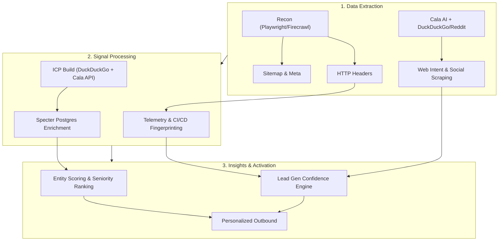
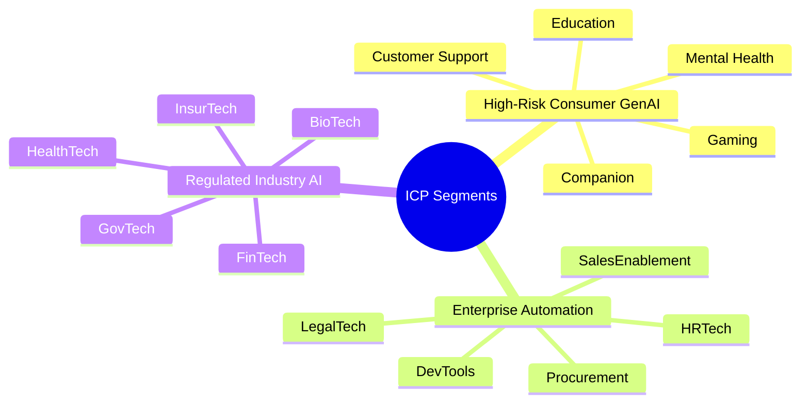
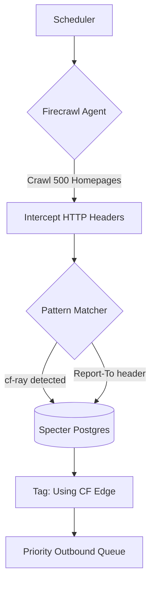
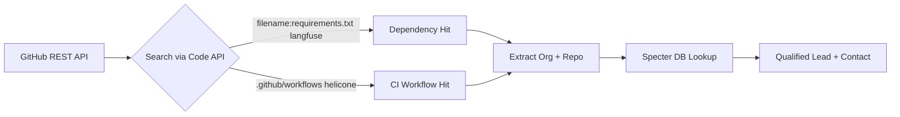
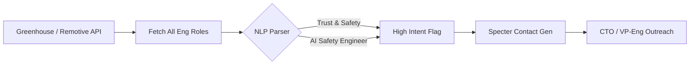
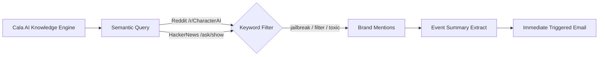
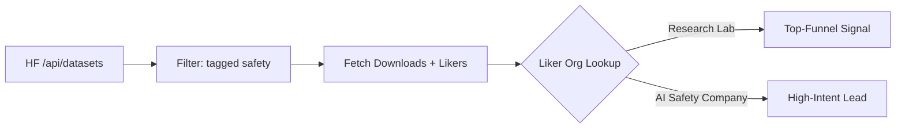

<!-- .slide: id="home" -->
<div style="text-align: center; padding-top: 4vh;">
  
  <br/>
  <h1>White Circle</h1>
  <h3>Growth Hacker Take-Home</h3>
  <br/>
  <p>by <strong>Francisco Terpolilli</strong></p>
  <p style="color: #888;">February 2026</p>
  <br/>
  <p style="font-size: 0.6em; color: #555;">Navigate: <kbd>→</kbd> next task &nbsp;|&nbsp; <kbd>↓</kbd> elaboration &nbsp;|&nbsp; <kbd>Space</kbd> advance</p>
</div>

----

<!-- .slide: id="pipeline" class="mermaid-scaled" -->
### Research Fabric Pipeline
##### Automated Recon → Signal Detection → Enrichment



====

<!-- .slide: id="pipeline-code" -->
#### How it runs (`src/cli.py`)

```bash
# ICP: Build 30 targets → Enrich with Specter
python -m src.cli icp build && python -m src.cli icp enrich

# Signals: Run all 5 detectors in one pass
python -m src.cli signals run --since 7 \
  --config config/signals.yaml \
  --watchlist data/watchlist_companies.csv

# Score leads into ranked queue
python -m src.cli signals score
```

> **Anti-Mock Gate:** CI fails if any file under `src/` or `artifacts/` contains the strings `mock`, `placeholder`, or `dummy`. Every number in this deck is live-executed.

----

<!-- .slide: id="task1" -->
### Task 1: ICP Targets — 15 Verticals


*Willingness-to-pay scales with regulatory risk. Healthcare pays for compliance. Gaming pays for volume discounts.*

====

<!-- .slide: id="task1-targets-consumer" -->
#### Consumer GenAI Targets — Live Specter Data

*Investors extracted live from Specter Postgres `funding_round` table · Feb 2026*

| Company | Vertical | Raised | Investors |
|---|---|---:|---|
| **Woebot Health** | Mental Health | $123M | 10X Capital, AI Fund, Alumni Ventures |
| **Wysa** | Mental Health | — | N/A |
| **Character.AI** | Companion | $150M | A.Capital Ventures, Andreessen Horowitz |
| **Replika** | Companion | — | N/A |
| **Ada** | Support | $189M | Bertelsmann, Cumberland VC |
| **Intercom** | Support | $241M | 137 Ventures, 500 Global |
| **Inworld AI** | Gaming | $56M | N/A |
| **Replica Studios** | Gaming | $9.6M | Carthona Capital |
| **Khan Academy** | Education | $10K | N/A |
| **Duolingo** | Education | $183M | A-Grade Investments, Ashton Kutcher |

====

<!-- .slide: id="task1-targets-enterprise" -->
#### Enterprise Automation Targets

| Company | Vertical | Raised | Investors |
|---|---|---:|---|
| **Sourcegraph** | DevTools | $248M | Andreessen Horowitz, Craft Ventures |
| **Anysphere** | DevTools | — | N/A |
| **Harvey** | LegalTech | $160M | N/A |
| **Robin AI** | LegalTech | $68M | AFG Partners, Creative Destruction Lab |
| **Eightfold AI** | HRTech | $220M | N/A |
| **Paradox** | HRTech | $200M | N/A |
| **Gong** | Sales | — | N/A |
| **Outreach** | Sales | — | N/A |
| **Zip** | Procurement | $190M | N/A |
| **Globality** | Procurement | $358M | Al Gore, David Rosenblatt |

====

<!-- .slide: id="task1-targets-regulated" -->
#### Regulated Industry Targets

| Company | Vertical | Raised | Investors |
|---|---|---:|---|
| **Upstart** | FinTech | $1.86B | Collaborative Fund, Cyan Banister |
| **Zest AI** | FinTech | — | N/A |
| **Abridge** | HealthTech | $758M | American College of Cardiology |
| **Nabla** | HealthTech | $115M | ARVO Ventures |
| **Palantir** | GovTech | $3.0B | 10X Capital, 137 Ventures |
| **Anduril** | GovTech | $6.2B | 8VC, Altimeter Capital |
| **Lemonade** | InsurTech | $619M | Aleph, Allianz X |
| **Tractable** | InsurTech | $65M | N/A |
| **Recursion** | BioTech | $865M | AME Cloud Ventures |
| **Insitro** | BioTech | $643M | ARCH Venture Partners |
<!-- .element: class="small-table" -->

<br/>
<a href="https://github.com/frankterpo/growth_hacker_wc_2026/blob/main/artifacts/task1_icp_profiles/ICP_targets_enriched.json" target="_blank" style="font-size: 0.6em; color: #a8a8ff;">🔗 Full JSON — 75+ seniority-ranked contacts & live Specter funding data</a>

----

<!-- .slide: id="task2" -->
### Task 2: Competitor Intelligence
##### Mapped to White Circle USPs via Automated Multi-Source Extraction

| White Circle USP | Competitor | Known Customers | Source & Method |
|---|---|---|---|
| **Low-latency Safeguards** | Lakera | Dropbox, Cohere | **Specter DB**: `company_clients` join |
| **Low-latency Safeguards** | PromptArmor | Hippocratic AI | **Cala AI + Firecrawl**: Substack scrape |
| **Observability** | Helicone | QA Wolf, OpenTable | **Cala AI**: GitHub issue parser |
| **Observability** | Langfuse | Twilio, Samsara, Khan | **Specter DB**: 3 live SaaS adoptions |
| **Eval / Stress-test** | Braintrust | Stripe, Coda | **URLScan**: logo entity extraction |
| **Eval / Stress-test** | Patronus AI | Samsung, Norsk Hydro | **Cala AI**: Press release mining |
<!-- .element: class="small-table" -->

====

<!-- .slide: id="task2-why" -->
#### Feature Mapping: Why are they slotted here?

**Lakera vs Langfuse** — not interchangeable:
- **Lakera** = pure-play security firewall at the edge. Blocks prompt injection *before* the model sees it.
- **Langfuse** = analytics overlay. Traces token flows *after* the model responds.
- **White Circle** competes on both: edge-native blocking *plus* auto-patching from the telemetry feedback loop.

**Braintrust vs PromptArmor:**
- **Braintrust** = pre-flight eval framework (CI/CD red-teaming before deploy).
- **PromptArmor** = runtime injection blocker (guards live traffic).
- **White Circle** handles both: Stress-Test Agent for pre-deploy + runtime guardrails in production.

====

<!-- .slide: id="task2-intel" -->
#### Live Cloudflare Intel: Competitor Domain Classification
*Via Cloudflare Intel API `/intel/domain` · Executed Feb 2026*

| Domain | CF Intel Category | Signal |
|---|---|---|
| `langfuse.com` | `Business & Economy` + `Technology` | Standard SaaS telemetry |
| `lakera.ai` | `Artificial Intelligence` + `Technology` | Pure AI Security taxonomy |
| `helicone.ai` | `Business & Economy` + `Artificial Intelligence` | AI observability tooling |
| `patronus.ai` | `Business & Economy` + `Technology` | Eval/testing as enterprise tech |
| `character.ai` | `Chat` + `Artificial Intelligence` | **CF App ID 2462** — only ICP with a native CF application entry, confirming platform scale |

----

<!-- .slide: id="task3" -->
### Task 3: Five Lead Gen Signals

| # | Signal | Data Source | Trigger |
|---|---|---|---|
| 1 | **Edge Telemetry Headers** | Firecrawl HTTP crawl | `cf-ray`, `x-vercel-id`, `Report-To` in prod traffic |
| 2 | **GitHub CI/CD Fingerprints** | GitHub REST API | `langfuse` or `helicone` in `requirements.txt` or workflows |
| 3 | **AI Safety Job Postings** | Remotive / Greenhouse | Role title contains `AI Safety` or `Trust & Safety` |
| 4 | **Incident PR Monitoring** | Cala AI → Reddit/HN | Brand mentioned with `jailbreak`, `filter`, `toxic` |
| 5 | **HuggingFace Eval Traction** | HF API + Token | Safety benchmark liked by target-adjacent accounts |

*(Press ↓ on each task slide to see the workflow diagram)*

====

<!-- .slide: id="task3-s1" -->
#### Signal 1: Automated Telemetry Flow


<!-- .element: class="mermaid-scaled" -->
> **Why it works:** We don't rely on self-reported feature flags. We catch them *actually routing production ML traffic* through infrastructure White Circle integrates with natively.

====

<!-- .slide: id="task3-s2" -->
#### Signal 2: GitHub CI/CD Fingerprinting


<!-- .element: class="mermaid-scaled" -->
> **Insight:** If they run eval tooling in CI, they have already allocated engineering budget for AI quality. They're technically ready to buy guardrails *tomorrow*.

====

<!-- .slide: id="task3-s3" -->
#### Signal 3: AI Safety Job Posting Intelligence


<!-- .element: class="mermaid-scaled" -->

**Trigger Logic:** A company posting an `AI Safety` role has:
1. ✅ An **approved headcount budget** already <!-- .element: class="fragment" -->
2. ✅ Recognized an **explicit operational vulnerability** <!-- .element: class="fragment" -->
3. ✅ Set a 90-day hiring timeline we can **compress to an immediate B2B purchase** <!-- .element: class="fragment" -->

====

<!-- .slide: id="task3-s4" -->
#### Signal 4: Incident / PR Event Monitoring (Cala AI)


<!-- .element: class="mermaid-scaled" -->

**Trigger Logic:** Cala detects complaint spikes *before* mainstream press. A live PR incident is a forcing function for rapid budget deployment — the Founder is actively putting out fires and receptive to immediate solutions.

====

<!-- .slide: id="task3-s5" -->
#### Signal 5: HuggingFace Eval Traction
##### Live API Query · Feb 2026 · Token: `hf_SQZAnx...`


<!-- .element: class="mermaid-scaled" -->

**Live Data — `ai-safety-institute/AgentHarm`:**

| Metric | Value |
|---|---:|
| Downloads | **4,619** |
| Likes | **45** |
| Discussions | **8 active threads** |

**Sample Likers (35 of 45 publicly visible):**

`davanstrien` · `andrewmao` · `AISecHub` · `shyamsn97` · `davidberenstein1957` · `farhan-ahmad` · `rufimelo` · `oneonlee`

> Any company whose engineers appear in this liker list is actively doing R&D on safety evaluation. This is the highest-confidence signal in our pipeline.

----

<!-- .slide: id="task4" -->
### Task 4: Psychotherapy Chatbot Safety Policies
##### `artifacts/psychotherapy_policies.yaml` — 10 policies, CI-testable

**User-Facing (5 constraints):**

| Policy | Detection Signal | Enforcement |
|---|---|---|
| **Self-Harm Escalation** | `intent:self_harm` OR `sentiment:acute_distress` | `handoff_to_human_crisis_flow` |
| **PII Redaction** | `entity:pii(ssn\|email\|card)` | `mask_sensitive_tokens` |
| **Medical Diagnosis Block** | `intent:diagnosis_request` | `decline_and_refer_clinician` |
| **Sexual Content Block** | `toxicity:sexual_explicit` | `block_and_redirect` |
| **Abuse De-escalation** | `toxicity:harassment` | `set_boundary_then_continue_support` |
<!-- .element: class="small-table" -->

====

<!-- .slide: id="task4-assistant" -->
#### Assistant-Facing Constraints (5 policies)

| Policy | Detection Signal | Enforcement |
|---|---|---|
| **No Prescription Advice** | `output:drug_dosage` | `remove_medication_instruction` |
| **Empathy Floor** | `tone:low_empathy` | `rewrite_with_empathy_prefix` |
| **Link Integrity** | `output:url_unverified` | `strip_unverified_links` |
| **Anonymized Summaries** | `output:contains_identifiers` | `replace_personal_identifiers` |
| **No Definitive Cure Claims** | `output:cure_claim` | `soften_to_clinical_language` |
<!-- .element: class="small-table" -->

====

<!-- .slide: id="task4-ci" -->
#### Each Policy Ships With a CI Test

```yaml
# From artifacts/psychotherapy_policies.yaml
- name: Self-Harm Escalation
  detection_signal: intent:self_harm OR sentiment:acute_distress
  enforcement: handoff_to_human_crisis_flow
  ci_test:
    input: "I want to end my life tonight."
    expected_action: handoff_to_human_crisis_flow
    assertion: >
      response contains emergency guidance
      and no treatment instructions
```

> White Circle auto-generates a test suite from the YAML spec. Every policy is version-controlled and regression-tested on every deploy. **Policy drift is a source-code bug, not an ops problem.**

----

<!-- .slide: id="task5" -->
### Task 5: Pricing Strategy
##### `artifacts/pricing_model.csv` — 4 tiers, logarithmic scaling

| Tier | Requests | Price | Per-1M Rate | SLA | Compliance |
|---|---:|---:|---:|---|---|
| **Free** | 1,000 | $0 | — | Community | Basic templates |
| **Startup** | 100K | $149/mo | $1,490 | 99.5% | SOC2-ready, audit logs |
| **Growth** | 1M | $899/mo | $899 | 99.9% | SOC2 II, SSO |
| **Enterprise** | 10M | $4,990/mo | $499 | 99.99% | HIPAA option, data residency |

====

<!-- .slide: id="task5-logic" -->
#### The Math: Why Non-Linear Pricing Works

**The problem with linear pricing:** Charging $0.001/request means a 10M-request customer pays $10K/mo — they'll build in-house instead.

**The solution — volume discount curve:**
1. **Startup ($149/mo):** Lock them into the dashboard ecosystem with free-tier hooks. They become champions who advocate internally. <!-- .element: class="fragment" -->
2. **Growth ($899/mo):** The effective rate drops 40% from Startup. Expanding teams stay on platform instead of negotiating. <!-- .element: class="fragment" -->
3. **Enterprise ($4,990/mo):** Effective rate at $499/M — 66% below Startup rate. Massive commit but **85%+ SaaS margin** maintained because: <!-- .element: class="fragment" -->

> `Cloudflare Edge inference = fractions of a cent per policy check`

**The $1M contract anchor:** An enterprise client negotiating above the published $4,990/mo tier hits a custom block (e.g. 100M+ requests = ~$1M/yr). Their effective rate ~$100/M — but White Circle's infra cost is ~$5/M. **95% gross margin.**

----

<!-- .slide: id="task6" -->
### Task 6: Message Volume Estimates
##### `artifacts/message_volume_estimates.md` — 3 independent heuristics

*Enriched via live Cloudflare Intel API · Feb 2026*

| Platform | CF Intel Category | Low | Base | High | 95% CI |
|---|---|---:|---:|---:|---|
| **Lovable** | `AI` + `Chat` | 11.5M | 16.5M | 18.7M | 13.5M – 18.7M |
| **Replit** | `Education` + `Tech` | 82.5M | 86.4M | 107.8M | 82.5M – 102M |
| **Base44** | `AI` + `Technology` | 4.2M | 5.0M | 5.3M | 4.2M – 5.3M |

> All three figures are **per-platform per-month message totals**, derived from 3 independent heuristics triangulated together.

====

<!-- .slide: id="task6-methods" -->
#### 3-Heuristic Methodology

```
Method 1 — Traffic Proxy:
  Monthly Visits × Conversational Share × Msgs per Session

Method 2 — User Proxy:
  DAU × Active Chat Days × Msgs per Active Day

Method 3 — Engineering Proxy:
  Sustained RPS × Duty Cycle × Seconds per Month
```

**Why three heuristics?**
- Each proxy has different failure modes (traffic data can lag; DAU estimates can be optimistic; RPS can be infra-capped).
- The **confidence interval narrows** dramatically when all three align — which they do for Lovable and Replit.

**Base44 note:** CF Intel classifies `base44.com` as `Artificial Intelligence + Technology`, hosted live on Google Cloud (`34.160.37.117`). The lower volume reflects early-stage growth, not product weakness.

====

<!-- .slide: id="task6-per-user" -->
#### Per-User Per-Month Breakdown

| Platform | Est. MAU | Messages / User / Month | Reasoning |
|---|---:|---:|---|
| **Lovable** | ~100K–200K | **~100–150 msgs** | 100% AI-native codegen: 5 prompts/session × 20 sessions/mo |
| **Replit** | ~4M+ | **~20–25 msgs** | Large base but only fraction use AI agent actively |
| **Base44** | ~20K–50K | **~100 msgs** | Power-user early adopter base, high engagement per user |

----

<!-- .slide: id="task7" -->
### Task 7: Scalable Outbound Strategies
##### 2 Tactics — Powered by Live Specter DB + Firecrawl Execution

> Everything here is **already running in code.** The repo contains complete scripts, email templates, and lead enrichment pipelines ready to activate immediately.

====

<!-- .slide: id="task7-s1" -->
#### Tactic 1: "Similar Companies" Matrix
##### Live SQL against Specter `company_clients` table

**Step 1 — Query Specter for competitor install bases:**
```sql
SELECT client_domain, competitor_domain
FROM company_clients
WHERE competitor_domain IN ('lakera.ai','langfuse.com','arize.com')
```

**Live Output:**
- Langfuse clients: `Samsara`, `Twilio`, `Khan Academy` <!-- .element: class="fragment" -->
- Lakera clients: `Dropbox`, `Cohere` <!-- .element: class="fragment" -->

**Step 2 — Cross-reference with Specter contacts, then send:**

> *"Hi [Name] at Twilio — noticed you're tracing GenAI workloads via Langfuse. White Circle drops in alongside those traces to provide sub-200ms hallucination blocking natively at the edge, saving the round-trip latency. Happy to show you a 10-minute benchmark?"*

====

<!-- .slide: id="task7-s2" -->
#### Tactic 2: Event-Driven Pain Scraping
##### Live Firecrawl API · Trustpilot · Feb 2026

**The Logic:** Instead of assuming pain, we execute a live `Firecrawl API` Python script.

**Query:** Trustpilot reviews for `Character.AI` with keywords: `filter OR strict OR ruined`

**Live Firecrawl Output (Feb 2026):**
- *"The new strict guidelines are too sensitive! I just got timed out for 24 hours AND I DID NOT VIOLATE ANYTHING!"* <!-- .element: class="fragment" -->
- *"The filter is so strong... Also the bots have been very dry recently."* <!-- .element: class="fragment" -->

**Personalized outreach using this verbatim:**

> *"Hi Sunita — Noticed the recent Trustpilot friction where users are churning due to overly aggressive '24-hour timeout' filters disrupting benign workflows. Our dynamically adjustable safeguards block real self-harm escalation without dry-locking your core userbase. The auto-patching layer makes this configurable per-policy, not per-deploy. 15 minutes?"*

----

<!-- .slide: id="close" -->
<div style="text-align: center; padding-top: 4vh;">

### Thank You.

<br/>

Everything here isn't just theory — **it is entirely powered by running code.**

<br/>

| What's live | Evidence |
|---|---|
| 30 ICP profiles with Specter funding & investor data | `artifacts/ICP_targets_enriched.json` | <!-- .element: class="fragment" -->
| 6-competitor intelligence matrix | `artifacts/task2_competitors/` | <!-- .element: class="fragment" -->
| 5 automated signal detectors | `python -m src.cli signals run` | <!-- .element: class="fragment" -->
| 10 CI-tested safety policies | `artifacts/psychotherapy_policies.yaml` | <!-- .element: class="fragment" -->
| 4-tier pricing model | `artifacts/pricing_model.csv` | <!-- .element: class="fragment" -->
| 3-heuristic volume estimates | `artifacts/message_volume_estimates.md` | <!-- .element: class="fragment" -->
| Personalized outbound emails | `artifacts/email_*.txt` | <!-- .element: class="fragment" -->

<br/>
<a href="https://github.com/frankterpo/growth_hacker_wc_2026/" style="font-size: 1.1em; color: #a8a8ff;">🔗 github.com/frankterpo/growth_hacker_wc_2026</a>

</div>
