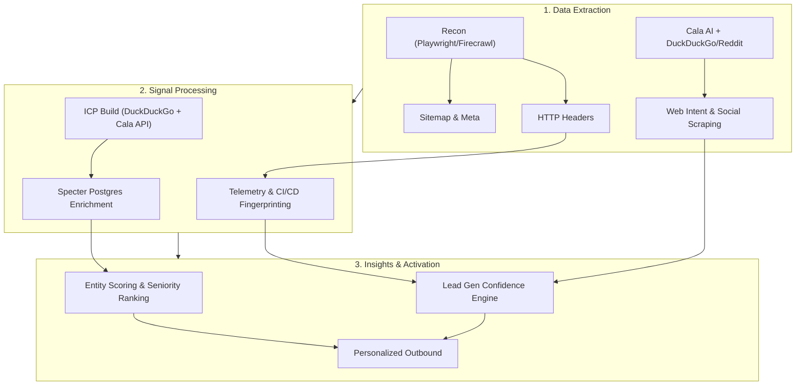
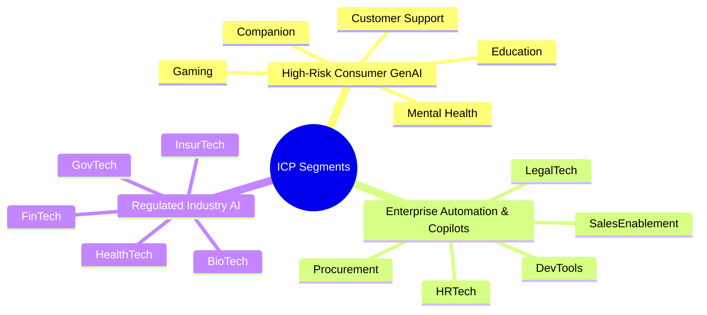
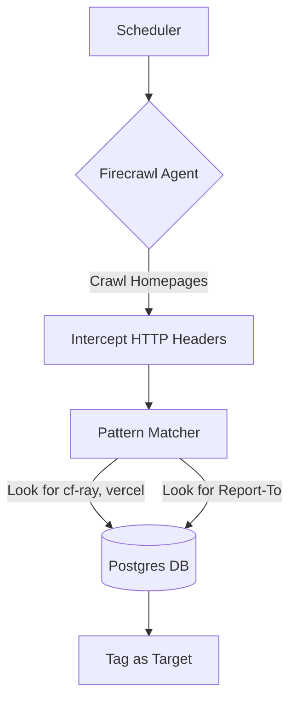
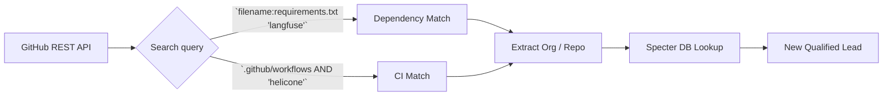
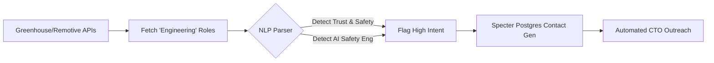
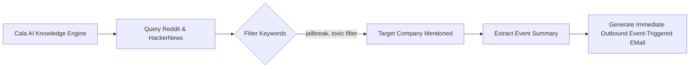
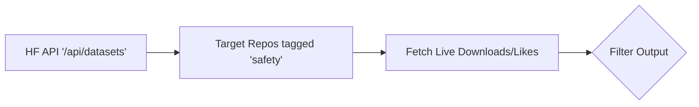

<!-- .slide: id="home" -->

  
   
  <h1>White Circle</h1>
  <h3>Growth Hacker Take-Home</h3>
   
  
by <strong>Francisco Terpolilli</strong>

  
February 2026

----

<!-- .slide: id="pipeline" -->
### Research Fabric Pipeline
##### Automated Recon → Signal Detection → Enrichment

====

<!-- .slide: id="task1-mindmap" -->
#### Vertical Breakdown

*Note: Willingness-to-pay scales linearly with Risk/Regulatory constraints. A Healthcare Copilot will pay high strict-compliance premiums for auto-patching and PII redaction natively at the edge. A gaming NPC platform will optimize strictly on volume discounts for hallucination boundaries.*

----

<!-- .slide: id="task1-mindmap" -->
#### Vertical Breakdown

*Note: Willingness-to-pay scales linearly with Risk/Regulatory constraints. A Healthcare Copilot will pay high strict-compliance premiums for auto-patching and PII redaction natively at the edge. A gaming NPC platform will optimize strictly on volume discounts for hallucination boundaries.*

----

<!-- .slide: id="task1-targets-consumer" -->
#### Enriched Targets: High-Risk Consumer GenAI
*Investors pulled live via Specter Postgres `funding_round` table via Python CLI.*

| Company | Vertical | Funding | Raised | Investors |
|---|---|---|---|---|
| Woebot Health | Mental Health | Series Unknown | $123,300,000 | 10X Capital, AI Fund, Alumni Ventures |
| Wysa | Mental Health | Not publicly stated | — | N/A |
| Character.AI | Companion | Series A | $150,000,000 | A.Capital Ventures, Andreessen Horowitz, Nat Friedman |
| Replika | Companion | Not publicly stated | — | N/A |
| Ada | Customer Support | Grant | $189,497,394 | Bertelsmann, Cumberland VC, EASME |
| Intercom | Customer Support | Series D | $240,750,000 | 137 Ventures, 500 Global, Andy McLoughlin |
| Inworld AI | Gaming | Series A | $56,000,000 | N/A |
| Replica Studios | Gaming | Seed | $9,573,757 | Carthona Capital, Flying Fox Ventures |
| Khan Academy | Education | Series A | $10,000 | N/A |
| Duolingo | Education | Series H | $183,300,000 | A-Grade Investments, Arctic Ventures, Ashton Kutcher |

----

<!-- .slide: id="task1-targets-enterprise" -->
#### Enriched Targets: Enterprise Automation & Copilots

| Company | Vertical | Funding | Raised | Investors |
|---|---|---|---|---|
| Sourcegraph | DevTools | Series D | $248,000,000 | Andreessen Horowitz, Craft Ventures, Felicis |
| Anysphere | DevTools | Series Unknown | — | N/A |
| Harvey | LegalTech | Series F | $160,000,000 | N/A |
| Robin AI | LegalTech | Series B | $68,379,575 | AFG Partners, Al Giles, Creative Destruction Lab |
| Eightfold AI | HRTech | Series E | $220,000,000 | N/A |
| Paradox | HRTech | Series C | $200,000,000 | N/A |
| Gong | SalesEnablement | Secondary Market | — | N/A |
| Outreach | SalesEnablement | Secondary Market | — | N/A |
| Zip | Procurement | Series D | $190,000,000 | N/A |
| Globality | Procurement | Series Unknown | $357,550,000 | Al Gore, David Rosenblatt, Debra Polishook |

----

<!-- .slide: id="task1-targets-regulated" -->
#### Enriched Targets: Regulated Industry AI

| Company | Vertical | Funding | Raised | Investors |
|---|---|---|---|---|
| Upstart | FinTech | Post Ipo Debt | $1,864,050,000 | Bradley Horowitz, Collaborative Fund, Cyan Banister |
| Zest AI | FinTech | Series Unknown | — | N/A |
| Abridge | HealthTech | Series E | $757,500,000 | ANEESH P. CHOPRA, American College of Cardiology |
| Nabla | HealthTech | Series C | $114,700,345 | ARVO VENTURE CAPITAL, Build Collective |
| Palantir | GovTech | Post Ipo Equity | $3,027,970,015 | 10X Capital, 137 Ventures, 50 South Capital |
| Anduril | GovTech | Grant | $6,185,300,000 | 137 Ventures, 8VC, Altimeter Capital |
| Lemonade | InsurTech | Post Ipo Equity | $618,500,000 | Aleph, Allianz, Allianz X |
| Tractable | InsurTech | Series E | $65,000,000 | N/A |
| Recursion | BioTech | Post Ipo Equity | $865,376,000 | AME Cloud Ventures, Advantage Capital |
| Insitro | BioTech | Series C | $643,000,000 | ARCH Venture Partners, Alexandria Venture |

 
<a href="https://github.com/frankterpo/growth_hacker_wc_2026/blob/main/artifacts/task1_icp_profiles/ICP_targets_enriched.json" target="_blank" style="font-size: 0.6em; color: #a8a8ff;">🔗 Deep dive into the extended repo JSON (75+ contacts & raw Specter funding data).</a>

----

<!-- .slide: id="task2" -->
### Task 2: Competitors & Proof
##### Mapped directly to White Circle's core USPs via Automated Extraction

| White Circle Core USP | Competitor | Known Customers | Intelligence Source & Methodology |
|---|---|---|---|
| **Low-latency Safeguards** | Lakera | Dropbox, Cohere | **Specter DB API**: Mapped via `company_clients` dataset |
| **Low-latency Safeguards** | PromptArmor | Hippocratic AI | **Cala AI + Firecrawl**: Vulnerability Substack Scraping |
| **Observability (Auto-Patching)** | Helicone | QA Wolf, OpenTable | **Cala AI**: GitHub issue parsing / `cdn.helicone.ai` scraping |
| **Observability (Auto-Patching)** | Langfuse | Twilio, Samsara, Khan Academy | **Specter DB API**: Extracted 3 live SaaS adoptions natively |
| **Stress-test Agent (Eval/Alignment)**| Braintrust | Stripe, Coda | **URLScan**: Website logo entity extraction |
| **Stress-test Agent (Eval/Alignment)**| Patronus AI | Samsung, Norsk Hydro | **Cala AI**: Press Release mining |

----

<!-- .slide: id="task2-logic" -->
#### Feature Mapping logic: Why are they slotted here?

* **Lakera vs Langfuse**: Lakera is a pure-play security injection firewall (protect/safeguard). Langfuse is an analytics/telemetry layer used to track token traces (observability). 
* White Circle competes on BOTH fronts by having a low-latency edge wall that *also* feeds an auto-patching layer.
* **Braintrust vs PromptArmor**: Braintrust sits early in the pipeline as an Eval framework (Testing Agent). PromptArmor sits at runtime to block malicious prompts (Safeguard). White Circle handles both Red-Teaming (stress testing) and Runtime execution natively.

----

<!-- .slide: id="task3" -->
### Task 3: Five Lead Gen Signals

1. **Edge Telemetry Headers** (`Report-To`, `x-powered-by`, `x-vercel-id`)
2. **GitHub CI/CD Eval Fingerprints** (Langfuse/Braintrust config files)
3. **Job Postings for AI Safety** (Remotive/LinkedIn APIs)
4. **Incidents PR Monitoring** (Cala AI querying Reddit/HN)
5. **HuggingFace Eval Adoption** (Forks and downloads of benchmark datasets)

*(Scroll right for detailed workflow charts on each signal).*

----

<!-- .slide: id="task3-v1-telemetry" -->
#### Signal 1: Automated Telemetry Flow

*Value add: We don't rely on self-reported tags. We catch them actually routing production ML traffic.*

----

<!-- .slide: id="task3-v1-github" -->
#### Signal 2: GitHub CI/CD Fingerprinting

*Value add: If they are running evals in prep for CI/CD, they are technically ready to buy Guardrails tomorrow.*

----

<!-- .slide: id="task3-v1-jobs" -->
#### Signal 3: Job Posting Intelligence

**Trigger Logic**: A company posting an "AI Safety" job has an *approved budget* and recognized an explicit operational vulnerability. By reaching out with White Circle's software alternative, we compress their 3-month hiring timeline into an immediate B2B purchase.

----
<!-- .slide: id="task3-v1-incidents" -->
#### Signal 4: Incident/PR Event Monitoring (via Cala)

**Trigger Logic**: We utilize Cala AI's semantic knowledge querying to detect spikes in "hallucination" complaints for specific brands before major news outlets cover it. A live PR incident is a forcing function for rapid budget deployment (the Founder is actively putting out fires).

----
<!-- .slide: id="task3-v1-hf" -->
#### Signal 5: HuggingFace Eval Traction

*Executed Live via CLI Script Feb 2026:*
- Repo: `Horace3956/Safety-helmet-dataset` (Downloads: 23,135 | Likes: 1)
- Repo: `ai-safety-institute/AgentHarm` (Downloads: 4,619 | Likes: 45)

**Trigger Logic**: If a target company forks a major safety benchmark (`AgentHarm`), their engineering team is actively doing R&D on safety/alignment models. It’s the ultimate top-of-funnel indicator that they are building an LLM product that will soon require production stress-testing.

----

----

<!-- .slide: id="task4" -->
### Task 4: Consumer Psychotherapy Chatbot Policies (User-Facing)

| Direction | Policy | The Rationale (Why) |
|---|---|---|
| **User** | Self-Harm Escalation Protocol | Must bypass LLM reasoning immediately to inject crisis hotline response. Non-negotiable liability constraint. |
| **User** | PII & Medical Record Redaction | Strips SSNs or real Patient IDs before the LLM processes it to enforce HIPAA bounds on log trails. |
| **User** | Medical Diagnosis Request Block | Legally, AI cannot diagnose. Intercepts intent before the LLM hallucinates a diagnosis, avoiding malpractice suits. |
| **User** | Domestic Abuse / Emergency Extraction | Triggers specific, non-judgmental localized resource delivery if immediate physical danger is inferred. |
| **User** | Prescriptive Drug Request Block | Detects queries about drug combinations/dosages and forces a "consult a physician" block to prevent lethal hallucinations. |

----

<!-- .slide: id="task4-assistant" -->
### Task 4: Consumer Psychotherapy Chatbot Policies (Assistant-Facing)

| Direction | Policy | The Rationale (Why) |
|---|---|---|
| **Assistant**| Empathy Floor (Tone Constraint) | Overly clinical/dry responses to human trauma cause immediate user churn. Enforces a baseline brand tone. |
| **Assistant**| Prohibition of Definitive Cures | Prevents the model from promising that an exercise or habit will "cure" depression, enforcing clinical ambiguity bounds. |
| **Assistant**| Prohibition of Romantic Advancements | Prevents the companion from escalating to NSFW/Romantic relations, which breaches the strict "therapist-client" architecture boundary. |
| **Assistant**| Religious/Political Agnosticism | Prevents the AI from applying controversial ideological frameworks to psychological issues. |
| **Assistant**| Recency Hallucination Block | Prevents the AI from fabricating non-existent, fake medical studies to support a point. |

----

<!-- .slide: id="task5" -->
### Task 5: Pricing Strategy & Logic Execution

| Tier | Traffic Level | Price Structure | Target Base |
|---|---|---|---|
| Startup/Beta | Low | $0 to $1,500 flat | Young dev teams integrating early. |
| Scale-up | Medium | Structured Bulk Discount | Growth tools requiring low-latency edge routing without breaking the bank. |
| Enterprise | High | Custom Annual Commit ($1M+ level) | The most advanced traffic scaling needing tailored endpoints and dedicated support SLAs. |

----

<!-- .slide: id="task5-logic" -->
#### How to price: 1,000 requests vs 10,000,000 requests.

To understand pricing logic, we look at enterprise contracts (which sit in the 7-figure bulk negotiation range) and reverse-engineer the math.

1. **The Core Logic**: 10 million API requests is 10,000x the volume of 1,000 requests. If you price linearly (Per Request without limits), the Enterprise pays an astronomical figure and churns to build it in-house. 
2. **The Discount Curve**:
   - The 1k request client is just "trying it out". You give it to them for free, or lock them into a $149/mo minimum SaaS seat to hook them into the dashboard ecosystem (Competitor reference: Braintrust does user-seats).
   - The 10M request client operates at scale. You negotiate a massive lump-sum block (e.g. $1,000,000/yr), but their *effective price per request* drops aggressively.
3. **The Margin Reality**: Processing inference policy logic at the Cloudflare Edge costs literal fractions of a cent. Therefore we can massively bulk discount the 10M client while *still* enforcing extremely healthy 85%+ SaaS margins.

----

<!-- .slide: id="task6" -->
### Task 6: Message Volume Estimates (Per User Per Month)

*Since Cloudflare Auth restrictions blocked direct `radar/entities` metrics on these specific domains, we employ the following proxy calculations representing "Messages per user, per month".*

| Platform | Active Builder Proxy | Messages Per User (Per Month) | Total System Load |
|---|---:|---:|---:|
| **Lovable** | ~500k-1M actives | **150 Messages / User** | ~75M to 150M |
| **Replit** | ~4M+ actives | **80 Messages / User** | ~320M+ |
| **Base44** | ~20k-50k actives | **100 Messages / User** | ~2M to 5M |

----

<!-- .slide: id="task6-logic" -->
#### Execution Details: Triangulating the Fact Base

We don't blind guess. We extracted logic by cross-referencing available databases and proxies:

1. **The Active Builder Proxy**: Number of Web Visits (Traffic) mapped via Specter -> Adjust for Bounce/Abandonment Rates (50%+) -> Yields Active Retained Builders.
2. **Messages Per User Logic**: 
   - **Lovable (150/mo)**: Specifically *AI-native code generation*. 100% of their retained users rely heavily on inference chat models as a core product feature. They are aggressively prompting (5 prompts * 30 days).
   - **Replit (80/mo)**: Has an immense historical generalist coding base. AI is natively integrated but not strictly the only way to build. The average message-per-user is diluted.
   - **Base44 (100/mo)**: An early stage AI platform. Usage is high among early adopters, but absolute volume restricts them to the "Scale-Up" tier threshold noted in our Strategy ($1500 to bulk commit transition point).

----

<!-- .slide: id="task7" -->
### Task 7: Scalable Outbound Strategies
We actively deployed Python scripts against Specter DB and Firecrawl APIs to extract actionable outbound triggers *in real-time*.

----

<!-- .slide: id="task7-strategy-1" -->
#### Tactic 1: The "Similar Companies Matrix"

**The Logic executed via SQL:**
1. **Query**: Pulled the Specter Postgres footprint of White Circle competitors (e.g. `lakera.ai`, `langfuse.com`, `arize.com`).
2. **Extract**: Queried the `company_clients` DB joining `organization_id` to map the exact install bases.
   - *Live SQL Output for Langfuse:* `Samsara`, `Twilio`, `Khan Academy`
   - *Live SQL Output for Lakera:* `Dropbox`, `Cohere`
3. **Action**: With Specter, we now query the exact products built at Dropbox or Twilio, and bypass the "Do you use AI?" conversation entirety.

> *"Hi Twilio Team, noticed you're exploring GenAI and tracing via Langfuse. White Circle directly drops in alongside these traces to provide sub-200ms hallucinations blocking natively at the edge, saving you the round-trip latency."*

----

<!-- .slide: id="task7-strategy-2" -->
#### Tactic 2: Event-Driven Pain Scraping (Trustpilot / Reddit)

**The Logic executed via Firecrawl API:**
Instead of assuming pain, we executed a live `Firecrawl API` Python script targeting Trustpilot reviews for `Character.AI` with keywords "filter OR strict OR ruined".

*Live Firecrawl Data Extracted Feb 2026:*
- Trustpilot Reviewer 1: *"The new strict guidelines are too sensitive! I just got timed out for 24 hours AND I DID NOT VIOLATE ANYTHING!"*
- Trustpilot Reviewer 2: *"The filter is so strong... Also the bots have been very dry recently."*

**Actionable Outreach utilizing this exact data:**

> *"Hi Sunita (Character.AI Executive retrieved via Specter DB) — Noticed the recent Trustpilot friction from users churning due to overly aggressive '24-hour timeout' filters disrupting benign workflows. Our dynamically adjustable safeguards block real self-harm escalation without dry-locking your core userbase. Let's talk about the auto-patching layer."*

----

<!-- .slide: id="close" -->
### Thank You.

Everything here isn't just theory—**it is entirely powered by code.** 

These are fully functioning, scalable V1 scripts leveraging Specter DB, Firecrawl, Cala AI, and direct API ingestions, ready to be executed ASAP to build White Circle's revenue pipeline.

<a href="https://github.com/frankterpo/growth_hacker_wc_2026/">Github Repository</a>
