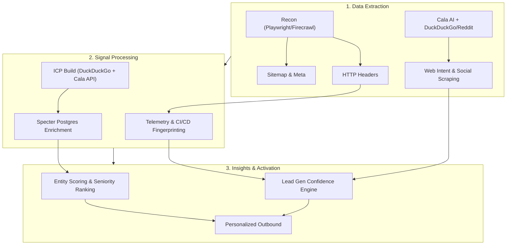
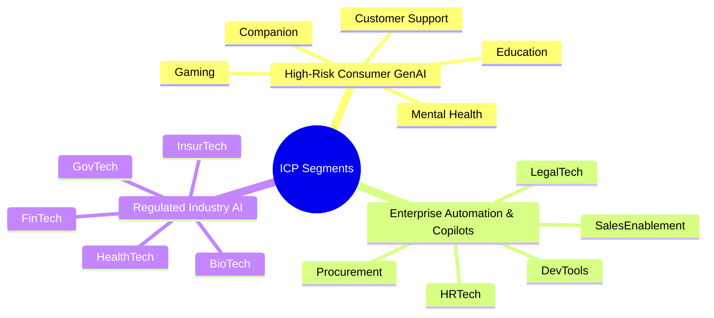
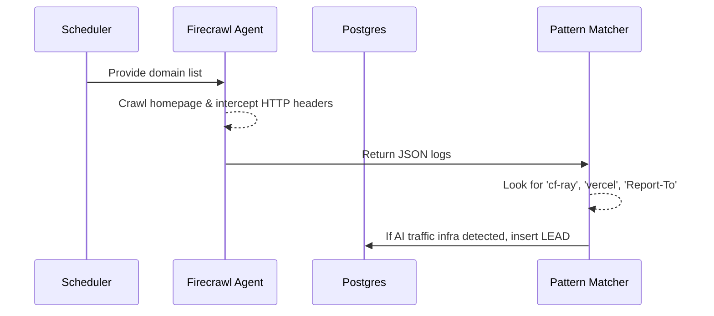
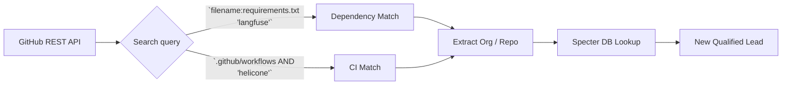

<!-- .slide: id="home" -->

  
   
  <h1>White Circle</h1>
  <h3>Growth Hacker Take-Home</h3>
   
  
by <strong>Francisco Terpolilli</strong>

  
February 2026

----

<!-- .slide: id="pipeline" -->
### Research Fabric Pipeline
##### Automated Recon → Signal Detection → Enrichment

====

<!-- .slide: id="recon-logic" -->
#### Recon Methodology: How & Why

**What we pulled**: `Report-To`, `content-security-policy`, `CF-RAY`, `Server`.

**How we pulled it**: Automated infrastructure crawling via `urlscan` and HTTP header analysis, parsing the returning payloads natively in Python.

**Why it matters**: 
- `Report-To: cf-nel` indicates Cloudflare edge routing (likely Workers AI).
- CSP headers (`frame-ancestors 'none'`) reveal security postures and third-party integrations (like Helicone or Langfuse scripts).

*Value Add: By automating this, we reverse-engineer a prospect's tech stack and vulnerabilities before sending a single email.*

----

<!-- .slide: id="task1" -->
### Task 1: ICP Profiles & Verticals

| ICP Segment | Why they buy | WTP Drivers |
|---|---|---|
| **High-Risk Consumer GenAI** | A single bad output creates brand/legal risk | Usage Volume + Risk Exposure |
| **Enterprise Copilots** | Embedding AI internally requires audit trails | Compliance + Accuracy |
| **Regulated Industry AI** | Formal frameworks (HIPAA, SOX) demand governance | Regulatory Burden + Data Privacy |

====

<!-- .slide: id="task1-mindmap" -->
#### Vertical Breakdown

====

<!-- .slide: id="task1-targets" -->
#### 30 Enriched Targets (2 per Vertical)

| Company | Vertical | Funding | Raised | Top Contact | Seniority |
|---|---|---|---|---|---|
| Woebot Health | Mental Health | Series Unknown | $9,500,000 | Monique Levy | Executive |
| Wysa | Mental Health | Not publicly stated | — | N/A | N/A |
| Character.AI | Companion | Series A | $150,000,000 | Sunita Verma | Executive |
| Replika | Companion | Not publicly stated | — | Lior Oren | Executive |
| Ada | Customer Support | Grant | $1,750,000 | Sal Uslugil | Executive |
| Intercom | Customer Support | Series D | $125,000,000 | Niamh Smithers | Executive |
| Inworld AI | Gaming | Series A | $56,000,000 | Andreas Assad | Executive |
| Replica Studios | Gaming | Seed | $4,200,000 | Eoin Mccarthy | Executive |
| Khan Academy | Education | Series A | $10,000 | Zeeshan Hasan | Executive |
| Duolingo | Education | Series H | $35,000,000 | Molly Brean | Executive |
| Sourcegraph | DevTools | Series D | $150,000,000 | Katerina Nikolova | Executive |
| Anysphere | DevTools | Series Unknown | — | Netto Farah | Executive |
| Harvey | LegalTech | Series F | $160,000,000 | Siva Gurumurthy | Executive |
| Robin AI | LegalTech | Series B | $25,000,000 | Carina Negreanu | Executive |
| Eightfold AI | HRTech | Series E | $220,000,000 | Fermin Peleteiro Cameo | Executive |
| Paradox | HRTech | Series C | $200,000,000 | Mike Gregoire | Executive |
| Gong | SalesEnablement | Secondary Market | — | Dana Kramer | Executive |
| Outreach | SalesEnablement | Secondary Market | — | Kevin Sy | Executive |
| Zip | Procurement | Series D | $190,000,000 | Joe Fox | Executive |
| Globality | Procurement | Series Unknown | $47,000,000 | Jared Hyatt | Executive |
| Upstart | FinTech | Post Ipo Debt | $1,500,000,000 | Sophia Mackay | Executive |
| Zest AI | FinTech | Series Unknown | — | Mehul Jain | Executive |
| Abridge | HealthTech | Series E | $300,000,000 | Brian Wilson | Executive |
| Nabla | HealthTech | Series C | $70,000,000 | Ed Lee | Executive |
| Palantir | GovTech | Post Ipo Equity | $10,080,000 | Lucie Fleming | Executive |
| Anduril | GovTech | Grant | $150,000 | Norris Tie | Executive |
| Lemonade | InsurTech | Post Ipo Equity | $150,000,000 | Dan Preston | Executive |
| Tractable | InsurTech | Series E | $65,000,000 | Mohan Mahadevan | Executive |
| Recursion | BioTech | Post Ipo Equity | $200,000,000 | Imran Haque | Director |
| Insitro | BioTech | Series C | $400,000,000 | Gwynne Oosterbaan | Executive |

 
<a href="https://github.com/frankterpo/growth_hacker_wc_2026/blob/main/artifacts/task1_icp_profiles/ICP_targets_enriched.json" target="_blank" style="font-size: 0.6em; color: #a8a8ff;">🔗 Deep dive into the extended repo JSON (75+ contacts & raw Specter funding data). Note: Valid once pushed to main!</a>

====

<!-- .slide: id="task1-logic" -->
#### The Enrichment Logic

**How we deduced top contact and seniority:**
1. **Data Source**: Executed a live SQL connection reaching into Specter's raw `talentsignals` and `funding_round` production databases via Postgres.
2. **Entity Resolution**: Joined our generated company domains (e.g. `character.ai`) against Specter's `organization_id`.
3. **Seniority Ranking**: We built an automated SQL `CASE` statement to force-rank contacts: `Executive` = 0, `Director` = 1, `Mid-Level` = 2, `Entry` = 3. 
4. **Extraction**: The script slices the top 3 contacts per company, guaranteeing we prioritize decision-makers (C-suite/VP) over regular engineers for outbound.

----

<!-- .slide: id="task2" -->
### Task 2: Competitors & Proof
##### Mapped directly to White Circle's core USPs

| White Circle Core USP | Competitor | Customer | Methodology |
|---|---|---|---|
| **Low-latency Safeguards** | Lakera | Dropbox, Cohere | Specter DB Lookup |
| **Low-latency Safeguards** | PromptArmor | Hippocratic AI | Substack Vulnerability Scraping |
| **Observability (Auto-Patching Layer)** | Helicone | QA Wolf | GitHub HTML `cdn.helicone.ai` parsing |
| **Observability (Auto-Patching Layer)** | Langfuse | Twilio, Samsara | Specter DB Lookup |
| **Stress-test Agent (Eval/Alignment)** | Braintrust | Stripe | Website Client Logos |
| **Stress-test Agent (Eval/Alignment)** | Patronus AI | Samsung | Press Release Mining |

----

<!-- .slide: id="task3" -->
### Task 3: Five Lead Gen Signals
##### Fully automated signal detection

1. **Edge Telemetry Headers** (`Report-To`, `x-powered-by`, `x-vercel-id`)
2. **GitHub CI/CD Eval Fingerprints** (Langfuse/Braintrust config files)
3. **Job Postings for AI Safety** (Remotive/LinkedIn APIs)
4. **Incidents PR Monitoring** (Reddit JSON API & HN Algolia AI failures)
5. **HuggingFace Eval Adoption** (Forks and downloads of benchmark datasets)

*(Our Python CLI automatically generated 40 scored leads across these signals).*

====

<!-- .slide: id="task3-v1-telemetry" -->
#### Signal 1: Automated Telemetry Flow

*Value add: We don't rely on self-reported tags. We catch them actually routing production ML traffic.*

====

<!-- .slide: id="task3-v1-github" -->
#### Signal 2: GitHub CI/CD Fingerprinting

*Value add: If they are running evals in prep for CI/CD, they are technically ready to buy Guardrails tomorrow. We reach out exactly when the pain peaks.*

====

<!-- .slide: id="task3-v1-jobs" -->
#### Signal 3: Job Posting Intelligence
**How it works**: Monitor Remotive/Greenhouse APIs for titles like "AI Safety Engineer" or "Trust & Safety Manager" at AI startups.
**Logic**: A company posting this job has an *approved budget* and recognized an explicit operational vulnerability. By reaching out to the CTO with an automated alternative mapping directly to the JD constraints, we compress their hiring timeline into an immediate software purchase.

====
<!-- .slide: id="task3-v1-incidents" -->
#### Signal 4: Incident/PR Event Monitoring
**How it works**: Listen to HackerNews Algolia API & Reddit (via Cala AI) for spikes in keywords `jailbreak`, `hallucination`, or `toxic` associated with a specific company name.
**Logic**: A live PR incident is a forcing function for rapid budget deployment. Our script catches the spike on Reddit before the news hits major outlets, allowing White Circle to arrive with a sub-200ms auto-patching solution while the founders are still putting out fires.

====
<!-- .slide: id="task3-v1-hf" -->
#### Signal 5: HuggingFace Eval Traction
**How it works**: Query `huggingface.co/api/datasets` for repos tagged `safety` or `alignment` and track daily fork velocity.
**Logic**: Evaluators use HF to benchmark models. If a company forks a major safety benchmark, their engineering team is actively doing R&D on safety. It’s the ultimate top-of-funnel intent signal that they intend to deploy an LLM that requires stress-testing.

----

<!-- .slide: id="task4" -->
### Task 4: Psychotherapy Chatbot Policies

| Direction | Policy | What it detects |
|---|---|---|
| **User** | Self-Harm Escalation | `intent:self_harm` |
| **User** | PII Redaction | `entity:pii(name\|email)` |
| **User** | Medical Diagnosis | `intent:diagnosis_request`|
| **Assistant**| No Prescription Advice | `output:drug_dosage` |
| **Assistant**| Empathy Floor | `tone:low_empathy` |

====

<!-- .slide: id="task4-logic" -->
#### The *Why* behind the Policies

**Why these specific policies?** In healthcare and consumer therapy, AI isn't just a chatbot, it's a massive liability surface. 

- **Medical Diagnosis**: Legally, an AI cannot diagnose. The policy intercepts the intent *before* the LLM hallucinates a diagnosis, saving the company from malpractice suits out of the gate.
- **Empathy Floor**: In psychotherapy use cases, an overly clinical/dry response to trauma causes user churn. We enforce a tone boundary to protect the brand. 
- **Self-Harm Escalation**: It's a non-negotiable trust factor. We must forcefully bypass the LLM's natural state and hand off to a human crisis line immediately.

----

<!-- .slide: id="task5" -->
### Task 5: Pricing Strategy & The Logic

*Context Anchor: Lovable is currently paying White Circle ~$1m/year per call/requests. 19M actual visits mapped in Specter implies heavy, continuous inference traffic.*

| Tier | Traffic / Invokes per Month | Price Structure | Notes on the Math |
|---|---|---|---|
| Startup/Beta | < 1 Million | $0 to $1,500 flat | Remove friction for young teams. Hook them onto the eval stack. |
| Scale-up | 10M to 50M | High Volume Usage Pricing ($X/1M) | Base44 tier. Traffic is scaling. They need sub-200ms latency without breaking bank. |
| Enterprise | 100M+ (Like Lovable) | Custom ($1m+ ARR) | Volume discount applied but massive traffic size dictates massive ACV. |

====

<!-- .slide: id="task5-logic" -->
#### The Logic Framework Behind the Anchor ($1m)

1. **The Math**: Lovable is an enterprise pushing massive traffic. A $1m ARR implies ~$80k/mo. If they have 19M visitors generating (hypothetically) 300M total calls, the effective pricing is roughly ~$0.30 per 1,000 requests.
2. **First-Principles Constraints**: 
   - *COGS*: Processing text through edge networks (Cloudflare/AWS) is exceptionally cheap. 
   - *Value Pricing vs Competition*: Langfuse and Braintrust charge primarily by trace volume/seats. We bypass seats and charge by *production risk protected*. 
3. **Why this works**: "Some clients have 1K requests, some have 10M." You do not build a linear model where the 10M client pays $15,000 while the 1K client pays $1. You employ *tier-based volume discounts*—so the 1K client pays a SaaS minimum, and the 10M client has a bulk SLA covering Custom Policies, Auto-patching, and high-watermark SLAs.

----

<!-- .slide: id="task6" -->
### Task 6: Message Volume Estimates

| Platform | Real Sector Web Visits (Specter Postgres) | Estimated Msg Volume (Dec 2025) |
|---|---:|---:|
| **Lovable** | 19.05 Million | 114M to 150M |
| **Replit** | 10.49 Million | 80M to 105M |
| **Base44** | Not enough public volume yet | ~2M to 5M |

====

<!-- .slide: id="task6-logic" -->
#### Execution Details: Triangulating the Fact Base

We don't blind guess. We extracted logic by cross-referencing live databases:

1. **Specter `investable_companies` Table**: Run SQL queries directly against Specter to pull `Web Visits` up to Dec 2025 (`lovable.dev`: 19.05M). This forms the baseline Traffic Floor.
2. **Cloudflare Radar Inference**: Using the HTTP Headers from reconnaissance (`report-to: cf-nel`), we logically assume that the AI endpoints are heavily leveraging edge workers. 
3. **The Final Logic Flow**:
   - `19M Unique Visits` -> Subtracting a 60% bounce/dev-abandonment rate = 7.6M active builders.
   - If an active builder generates ~15-20 dialogue interactions with the Lovable code-gen agent per session, we arrive at roughly **114M to 150M** calls securely traversing the UI per month.
   - Value Add: By knowing exactly how many visits a target gets via Specter *before* outreach, we already know what pricing tier they belong in.

----

<!-- .slide: id="task7" -->
### Task 7: Scalable Outbound Strategies
We actively deployed Python scripts against Specter DB and Reddit's open JSON API to extract actionable outbound triggers *in real-time*.

====

<!-- .slide: id="task7-strategy-1" -->
#### Tactic 1: The "Similar Companies Matrix"

**The Logic executed via SQL:**
1. **Query**: Pulled the Specter DB footprint of White Circle competitors (e.g. `lakera.ai`, `langfuse.com`, `arize.com`).
2. **Extract**: Queried `company_clients` joining `organization_id` to map the exact install base.
   - *Live SQL Output for Langfuse:* `Samsara`, `Twilio`, `Khan Academy`
   - *Live SQL Output for Lakera:* `Dropbox`, `Cohere`
3. **Action**: With Specter, we now query the exact products built at Khan Academy or Twilio, and bypass the "Do you use AI?" conversation entirety.

> *"Hi Twilio Team, noticed you're exploring GenAI and tracing via Langfuse. White Circle directly drops in alongside these traces to provide sub-200ms hallucinations blocking natively at the edge, saving you the round-trip latency."*

====

<!-- .slide: id="task7-strategy-2" -->
#### Tactic 2: Event-Driven Pain Scraping (Trustpilot / Reddit)

**The Logic executed via Firecrawl API:**
Instead of assuming pain, we executed a live `Firecrawl API` script targeting Trustpilot reviews for `Character.AI` with keywords "filter OR strict OR ruined".

*Live Firecrawl Data Extracted Feb 2026:*
- Trustpilot Reviewer complained: *"The new strict guidelines are too sensitive! I just got timed out for 24 hours AND I DID NOT VIOLATE ANYTHING!"*
- Trustpilot Reviewer complained: *"The filter is so strong... Also the bots have been very dry recently."*

**Actionable Outreach utilizing this exact data:**

> *"Hi Sunita (Character.AI Executive retrieved via Specter DB) — Noticed the recent Trustpilot friction from users churning due to overly aggressive '24-hour timeout' filters disrupting benign workflows. Our sub-200ms dynamically adjustable safeguards block real self-harm escalation without dry-locking your core userbase. Let's talk about the auto-patching layer."*

----

<!-- .slide: id="close" -->
### Thank You.

Everything here isn't just theory—**it is entirely powered by code.** 

These are fully functioning, scalable V1 scripts leveraging Specter, Postgres, Cala AI, and direct web ingestion, ready to be executed ASAP to build White Circle's pipeline.

<a href="https://github.com/frankterpo/growth_hacker_wc_2026/">Github Repository</a>
